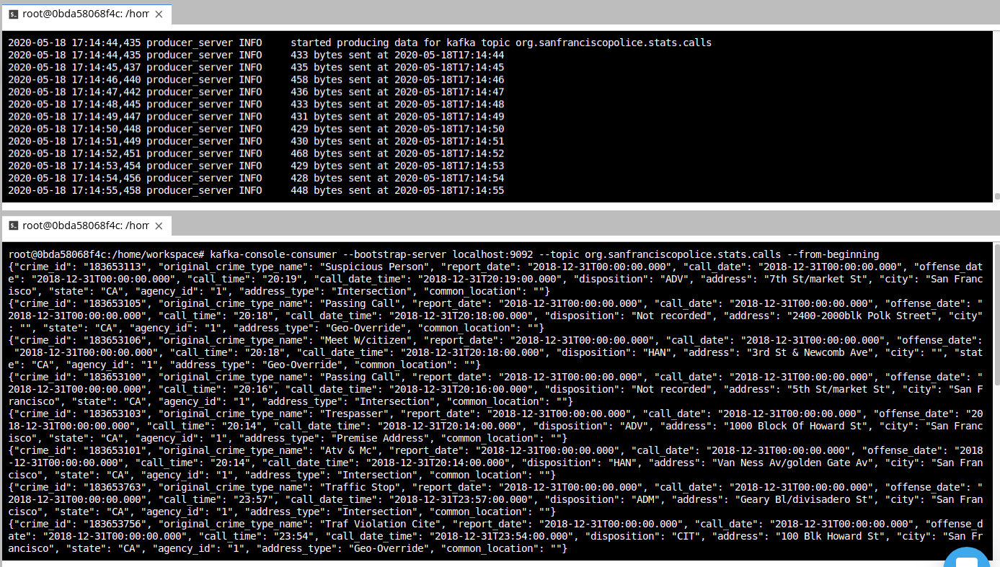
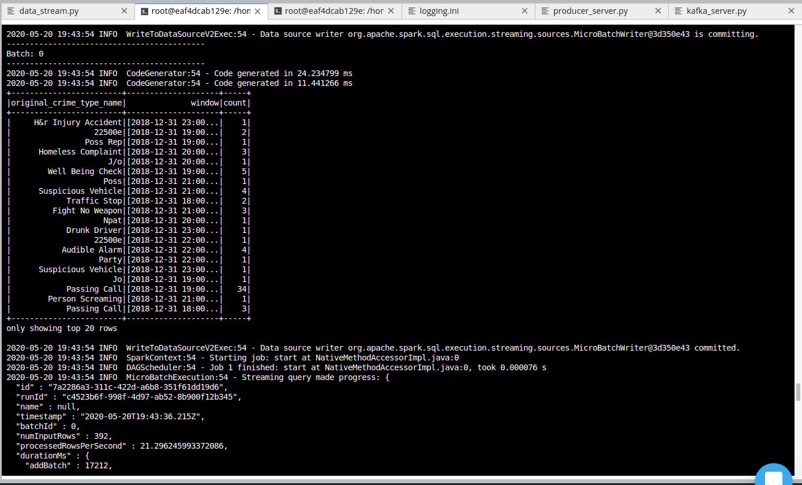
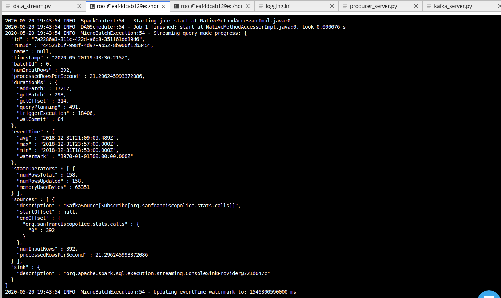
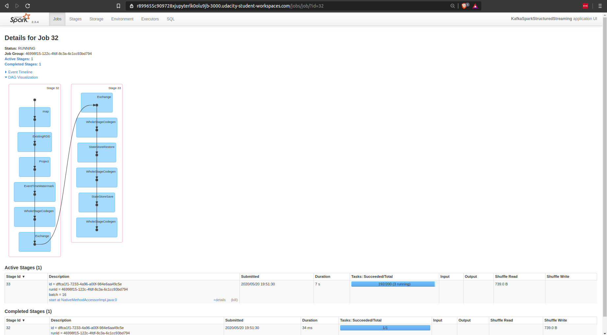

# Project Overview
This is project for the Udacity Data Streaming Nanodegree.
 It's provided a real-world dataset, extracted from Kaggle, on San Francisco crime incidents. 
The goal is to provide statistical analyses of the data using Apache Spark Structured Streaming. 

# Development Environment
Those are the development requirements

- Spark 2.4.3
- Scala 2.11.x
- Java 1.8.x
- Kafka build with Scala 2.11.x
- Python 3.6.x or 3.7.x

You can Run below commands to verify correct versions:
```
java -version
scala -version
```
Make sure your ~/.bash_profile looks like below (might be different depending on your directory):
```
export SPARK_HOME=/Users/dev/spark-2.4.3-bin-hadoop2.7
export JAVA_HOME=/Library/Java/JavaVirtualMachines/jdk1.8.0_181.jdk/Contents/Home
export SCALA_HOME=/usr/local/scala/
export PATH=$JAVA_HOME/bin:$SPARK_HOME/bin:$SCALA_HOME/bin:$PATH
```

# Running the server and checking the Producer
you can run the server with the following command
```
python kakfa_server.py
```
then you can verify the topic with the built-in kafka-console-consumer
```
kafka-console-consumer --bootstrap-server localhost:9092 --topic org.sanfranciscopolice.stats.calls
```
You will see an output like this



# Submit spark job and check results
```
spark-submit --packages org.apache.spark:spark-sql-kafka-0-10_2.11:2.3.4 --master local[*] data_stream.py
```
You will see a lot of information, however we are interested in check if we are consuming and aggregating the data from Kafka.
In order to check if 


Also after each new result from the query, you will also get a progress reporter, like the following,
containing useful information about the performance of your spark application.


Finally, the Spark UI, is available in the port 3000, it can be configure in the spark session.
```python
    sparkSession = SparkSession \
        .builder \
        .config('spark.ui.port', 3000) 
```
It is a useful tool, to explore your Spark cluster, including running jobs, executors, queries.


